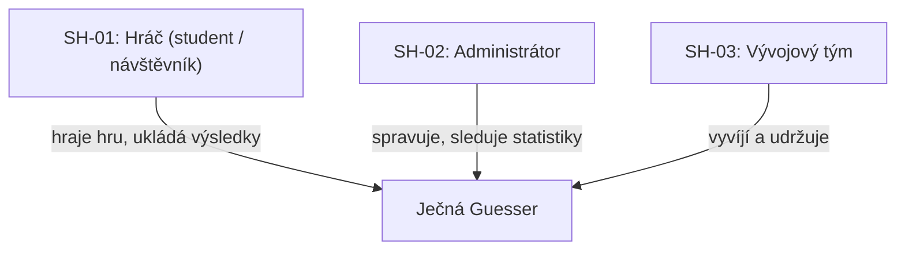
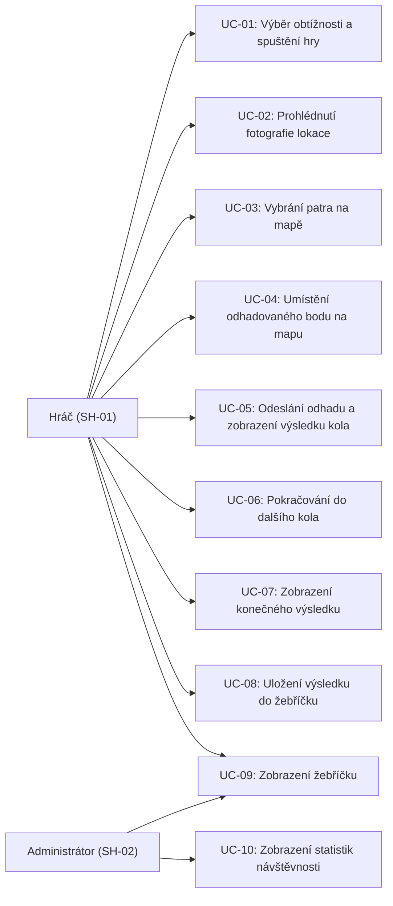
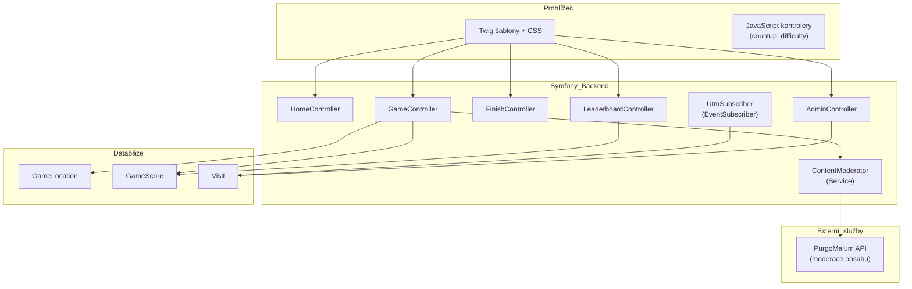
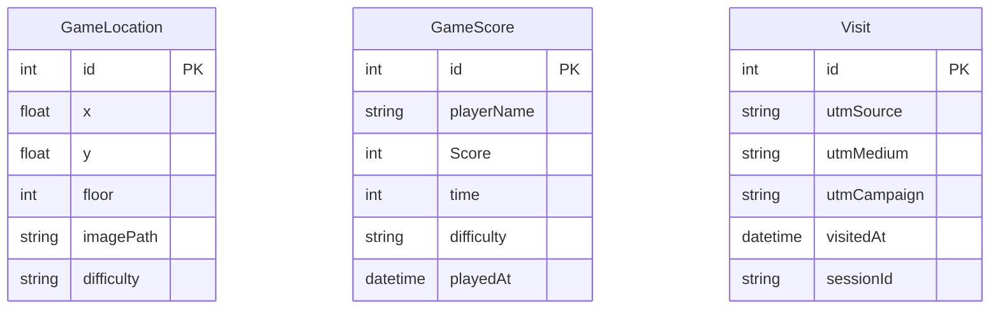
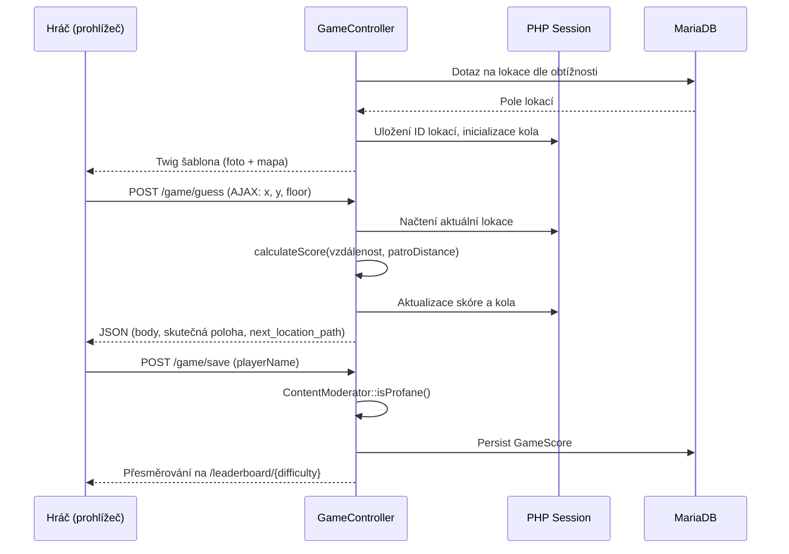
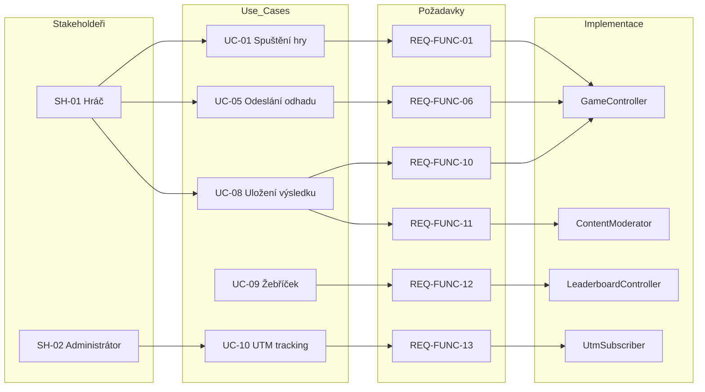
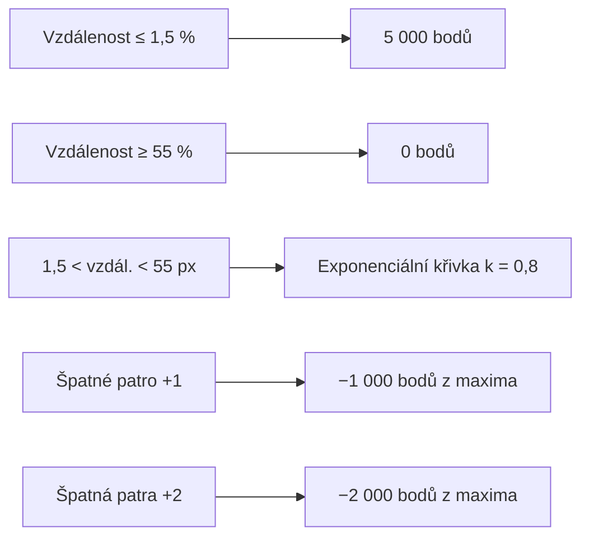
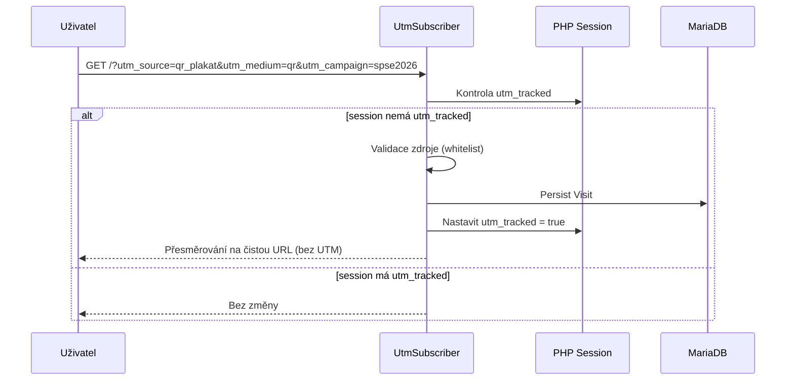

# Ječná Guesser – Předávací zpráva projektu

---

## Obsah

1. [Základní informace o projektu](#1-základní-informace-o-projektu)
2. [Cíle projektu](#2-cíle-projektu)
3. [Stakeholdeři](#3-stakeholdeři)
4. [Use Cases](#4-use-cases)
5. [Požadavky na systém](#5-požadavky-na-systém)
6. [Rozhodnutí o technologiích](#6-rozhodnutí-o-technologiích)
7. [Architektura systému](#7-architektura-systému)
8. [Trasovatelnost požadavků](#8-trasovatelnost-požadavků)
9. [Implementace](#9-implementace)
10. [Testování](#10-testování)
11. [Infrastruktura a nasazení](#11-infrastruktura-a-nasazení)
12. [Evidence práce](#12-evidence-práce)
13. [Ekonomické zhodnocení](#13-ekonomické-zhodnocení)
14. [Naměřená data z logů](#14-naměřená-data-z-logů)
15. [Zhodnocení projektu](#15-zhodnocení-projektu)
16. [Přílohy](#16-přílohy)

---

## 1. Základní informace o projektu

### 1.1 Popis aplikace

Ječná Guesser je webová geolokační hra inspirovaná populárními tituly typu GeoGuessr. Uživateli je prezentována fotografie pořízená v prostorách Střední průmyslové školy elektrotechnické Ječná v Praze. Úkolem hráče je určit na interaktivní mapě školy, kde přesně byla fotografie pořízena, včetně správného patra budovy.

Hra se skládá z pěti kol, každé s jinou lokací. Na základě přesnosti odhadu je hráč hodnocen bodovým systémem až do maxima 25 000 bodů. Výsledky jsou evidovány v žebříčku hráčů.

Odevzdání proběhlo dne 26. 03. 2026.

### 1.2 Členové týmu a jejich role

|Jméno|Role|Oblasti odpovědnosti|
|---|---|---|
|Samuel Majer|Dokumentarista|Zaznamenávání, psaní|
|Neil Malhotra|Sys admin|Infrastruktura, nasazení|
|Jakub Novák|SCRUM master|Vedení týmu|
|Jakub Špernoga|Backend Developer|Tvorba backendu, DB|
|Adam Švec|Designer / Frontend / QA|UI design, CSS, grafické podklady|

---

## 2. Cíle projektu

### 2.1 Problémová doména

Studenti a návštěvníci školy často neznají rozložení budovy detailně. Hra tento problém řeší záživnou formou a zároveň umožňuje soutěžení a porovnání výsledků prostřednictvím žebříčku.

### 2.2 Konkrétní cíle

- Navrhnout a implementovat funkci hry s více obtížnostmi (easy, medium, hard).
- Implementovat bodovací systém založený na geografické vzdálenosti a správnosti patra.
- Poskytnout uživateli vedení hry se zobrazením časomíry, skóre a počtu kol.
- Umožnit uložení výsledků a jejich zobrazení v žebříčku s filtrováním.
- Zajistit ochranu před nevhodným obsahem při ukládání uživatelských jmen.
- Sledovat návštěvnost aplikace prostřednictvím UTM parametrů.

---

## 3. Stakeholdeři

Následující diagram znázorňuje vztah stakeholderů k systému.



|ID|Stakeholder|Role|Očekávání od systému|
|---|---|---|---|
|SH-01|Hráč (student / návštěvník)|Primární uživatel aplikace|Jednoduché spuštění hry, férový bodovací systém, možnost uložit výsledek do žebříčku|
|SH-02|Správce (administrátor)|Provozovatel systému|Přehled o návštěvnosti, sledování UTM zdrojů, stabilní provoz|
|SH-03|Vývojový tým|Tvůrce a udržovatel systému|Čitelná architektura, udržovatelnost kódu, snadné přidávání nových lokací|

---

## 4. Use Cases

### 4.1 Diagram Use Cases



### 4.2 Seznam Use Cases

| ID    | Název                                     | Aktér                  | Stručný popis                                                                                                          |
| ----- | ----------------------------------------- | ---------------------- | ---------------------------------------------------------------------------------------------------------------------- |
| UC-01 | Výběr obtížnosti a spuštění hry           | Hráč                   | Hráč vybere obtížnost (easy / medium / hard) a stiskne PLAY. Systém inicializuje herní session s 5 náhodnými lokacemi. |
| UC-02 | Prohlédnutí fotografie lokace             | Hráč                   | Hráč si prohlédne fotografii prezentované lokace, aby odhadl místo.                                                    |
| UC-03 | Vybrání patra na mapě                     | Hráč                   | Hráč kliknutím na tlačítka pater (0–4) zvolí patro, na jehož mapu chce umístit odhad.                                  |
| UC-04 | Umístění odhadovaného bodu na mapu        | Hráč                   | Hráč klikne na mapu a označí odhadovanou polohu lokace.                                                                |
| UC-05 | Odeslání odhadu a zobrazení výsledku kola | Hráč / Systém          | Hráč potvrdí odhad. Systém vypočítá skóre kola, zobrazí správnou polohu a odpočítaný čas.                              |
| UC-06 | Pokračování do dalšího kola               | Hráč                   | Hráč po zobrazení výsledku kola pokračuje do dalšího kola nebo ukončuje hru.                                           |
| UC-07 | Zobrazení konečného výsledku              | Hráč / Systém          | Po pěti kolech systém zobrazí celkový počet bodů, čas a obtížnost.                                                     |
| UC-08 | Uložení výsledku do žebříčku              | Hráč                   | Hráč zadá uživatelské jméno a odešle výsledek k uložení do databáze.                                                   |
| UC-09 | Zobrazení žebříčku                        | Hráč / Administrátor   | Uživatel prochází žebříček s možností filtrování dle obtížnosti a zobrazení nejlepšího výsledku na hráče.              |
| UC-10 | Sledování návštěvnosti (UTM)              | Systém / Administrátor | Systém automaticky zaznamenává návštěvníky přicházející z definovaných UTM zdrojů. Administrátor si zobrazí přehled.   |

---

## 5. Požadavky na systém

### 5.1 Funkční požadavky

|ID|Název| Popis                                                                                                                 |Zdroj|Ověření|
|---|---|---|---|---|
|REQ-FUNC-01|Spuštění hry s výběrem obtížnosti| Systém musí umožnit hráči vybrat obtížnost (easy, medium, hard) a spustit hru.                                        |UC-01|Funkční test spuštění hry pro každý mód|
|REQ-FUNC-02|Náhodný výběr lokací| Systém musí pro každé herní session náhodně vybrat 5 lokací odpovídajících zvolené obtížnosti.                        |UC-01|Test náhodnosti – opakovaným spuštěním|
|REQ-FUNC-03|Zobrazení fotografie lokace| Systém musí zobrazit fotografii aktuální herní lokace.                                                                |UC-02|Vizuální ověření – fotografie se načte|
|REQ-FUNC-04|Přepínání pater mapy| Systém musí umožnit přepnout zobrazení mapy mezi patry 0 až 4.                                                        |UC-03|Test přepínání – kliknutí na každé tlačítko patra|
|REQ-FUNC-05|Umístění pinu na mapu| Systém musí umožnit hráči umístit jeden pin na mapu kliknutím.                                                        |UC-04|Test umístění – vizuální zobrazení pinu|
|REQ-FUNC-06|Výpočet skóre kola| Systém musí vypočítat skóre kola na základě euklidovské vzdálenosti odhadu od skutečné polohy a vzdálenosti pater.    |UC-05|Jednotkový test metody calculateScore|
|REQ-FUNC-07|Zobrazení výsledku kola| Systém musí po odeslání odhadu zobrazit body, skutečnou polohu a čarou spojit odhad se skutečnou polohou.             |UC-05|Funkční test po odeslání odhadu|
|REQ-FUNC-08|Časomíra| Systém musí měřit a zobrazovat čas hry v reálném čase.                                                                |UC-05|Test časomíry – spuštění a pauza|
|REQ-FUNC-09|Konec hry a zobrazení celkového výsledku| Systém musí po 5 kolech přesměrovat na stránku s celkovým skóre, časem a obtížností.                                  |UC-07|Test ukončení hry po 5 kolech|
|REQ-FUNC-10|Uložení výsledku| Systém musí umožnit uložit výsledek s uživatelským jménem do databáze.                                                |UC-08|Test uložení – ověření v DB|
|REQ-FUNC-11|Moderace uživatelských jmen| Systém musí prostřednictvím externí API (PurgoMalum) ověřit, že uživatelské jméno neobsahuje nevhodný obsah.          |UC-08|Test moderace s nevhodným vstupem|
|REQ-FUNC-12|Žebříček s filtry| Systém musí zobrazit žebříček výsledků s možností filtrování dle obtížnosti a přepínání nejlepšího výsledku na hráče. |UC-09|Funkční test žebříčku|
|REQ-FUNC-13|Sledování UTM návštěv| Systém musí automaticky zaznamenat návštěvníky přicházející z autorizovaných UTM zdrojů.                              |UC-10|Test UTM trackingu – GET s parametry|

### 5.2 Kvalitativní (nefunkční) požadavky

|ID| Název                  | Popis                                                                                      | Ověření                                     |
|---|---|---|---|
|REQ-QUAL-01| Odezva API             | Systém musí odpovědět na herní odhad do 500 ms za běžného zatížení.                        | Měření doby odeslání – čas odpovědi         |
|REQ-QUAL-02| Dostupnost             | Aplikace musí být dostupná minimálně 99 % času v rámci školního roku.                      | Monitoring uptime                           |
|REQ-QUAL-03| Bezpečnost vstupu      | Všechny uživatelské vstupy musí být validovány na backendu.                                | Test s nevalidními vstupními daty           |
|REQ-QUAL-04| Responzivita UI        | Rozhraní musí být použitelné na mobilních zařízeních s šířkou obrazovky od 320 px.         | Testování v DevTools na mobilních rozměrech |
|REQ-QUAL-05| Udržovatelnost kódu    | Kód musí dodržovat PSR standardy PHP a být členěn do vrstev Controller / Entity / Service. | Code review, statická analýza               |
|REQ-QUAL-06| Bezpečnost sessionu    | Herní stav musí být uložen v serverovém sessionu, nikoliv na klientovi.                    | Ověření – data sessionu v PHP session       |
|REQ-QUAL-07| Integrita dat žebříčku | Systém musí zamezit ukládání duplicitních nebo neplatných výsledků (skóre ≤ 0, čas ≤ 1 s). | Test hraničních hodnot při ukládání         |

---

## 6. Rozhodnutí o technologiích

### 6.1 Backend framework

Kritéria hodnocení a jejich váhy: zkušenosti týmu (4), stabilita a dokumentace (3), produktivita (3), nasaditelnost (2).

|Technologie|Zkušenosti (4)|Stabilita (3)|Produktivita (3)|Nasazení (2)|Skóre|
|---|---|---|---|---|---|
|Symfony 6.4|4 × 4 = 16|5 × 3 = 15|5 × 3 = 15|4 × 2 = 8|**54**|
|Laravel 11|2 × 4 = 8|5 × 3 = 15|5 × 3 = 15|4 × 2 = 8|46|
|Node.js / Express|2 × 4 = 8|4 × 3 = 12|3 × 3 = 9|5 × 2 = 10|39|
|Django (Python)|1 × 4 = 4|4 × 3 = 12|4 × 3 = 12|4 × 2 = 8|36|

**Zvolená technologie: Symfony 6.4.** Tým má se Symfony přímé zkušenosti z předchozích projektů. Framework poskytuje strukturovaný MVC přístup, integraci Doctrine ORM a Twig šablony, které byly pro projekt klíčové.

### 6.2 Databázový systém

Kritéria: výkon (váha 3), zkušenosti týmu (váha 4).

|Technologie|Výkon (3)|Zkušenosti (4)|Skóre|
|---|---|---|---|
|MariaDB|4 × 3 = 12|4 × 4 = 16|**28**|
|MySQL 8|4 × 3 = 12|3 × 4 = 12|24|
|PostgreSQL 16|5 × 3 = 15|2 × 4 = 8|23|
|SQLite|2 × 3 = 6|4 × 4 = 16|22|

**Zvolená technologie: MariaDB.** Databáze nabízí pokročilejší funkce a lepší integraci s Doctrine ORM než SQLite a tým s ní má přímé zkušenosti.

### 6.3 Frontend

Frontend je řešen pomocí Twig šablon integrovaných do Symfony, doplněných o Turbo (navigace podobná SPA). CSS je psáno ručně bez frameworku, čímž byla zajištěna plná kontrola nad designem. Tento přístup byl zvolen pro minimalizaci závislostí a plnou kompatibilitu se Symfony Asset Mapper.

### 6.4 Infrastruktura a webový server

Aplikace je provozována na VPS serveru s OS Debian/Ubuntu. Webový server Nginx plní funkci reverzní proxy před procesem PHP-FPM. Zdrojový kód je spravován v repozitáři Git na GitHubu.

---

## 7. Architektura systému

### 7.1 Architektonický vzor

Aplikace je postavena na vzoru Model-View-Controller (MVC) v rámci Symfony 6.4. Prezentační vrstva je tvořena Twig šablonami. Logika je rozdělena do Controllerů a Služeb. Data jsou spravována prostřednictvím Doctrine ORM.

### 7.2 Diagram architektury



### 7.3 Datový model



### 7.4 Tok dat – průběh jednoho herního kola



### 7.5 Popis komponent

|Komponenta|Typ| Odpovědnost                                                                             |
| ------------------------ | --------------- | --------------------------------------------------------------------------------------- |
|HomeController|Controller| Zobrazení úvodní stránky, zpracování volby obtížnosti a přesměrování na hru.            |
|GameController|Controller| Inicializace hry, zpracování odhadu, výpočet skóre, ukládání výsledků, správa sessionů. |
|FinishController|Controller| Zobrazení stránky s konečnými výsledky hry.                                             |
|LeaderboardController|Controller| Zobrazení a filtrování žebříčku.                                                        |
|AdminController|Controller| Přehled statistik návštěvnosti pro administrátory.                                      |
|ContentModerator|Service| Volání externí API PurgoMalum pro ověření uživatelských jmen.                           |
|UtmSubscriber|EventSubscriber| Zachycení HTTP požadavků s UTM parametry a jejich uložení do databáze.                  |
|GameLocation|Entity| Databázová entita lokace (souřadnice X/Y, patro, cesta k obrázku, obtížnost).           |
|GameScore|Entity| Databázová entita výsledku hry (jméno, skóre, čas, obtížnost, datum).                   |
|Visit|Entity| Databázová entita návštěvy s UTM parametry.                                             |
|Twig šablony|View| HTML šablony pro všechny stránky aplikace.                                              |
|countup_controller.js|Frontend JS| Časomíra s možností pauzy, restartu a synchronizace se serverovým časem.                |
|difficulty_controller.js|Frontend JS| Řízení výběru obtížnosti na úvodní stránce.                                             |
|app.css|Frontend CSS| Kompletní vizuální styl aplikace.                                                       |

---

## 8. Trasovatelnost požadavků

### 8.1 Diagram trasovatelnosti



### 8.2 Tabulka trasovatelnosti

| Requirement ID | Use Case | Komponenta                       | Implementace                                    |
| -------------- | -------- | -------------------------------- | ----------------------------------------------- |
| REQ-FUNC-01    | UC-01    | HomeController, GameController   | HomeController::index(), GameController::play() |
| REQ-FUNC-02    | UC-01    | GameController                   | GameController::play() – shuffle + slice        |
| REQ-FUNC-03    | UC-02    | Twig / assety                    | game.html.twig #locationImage                   |
| REQ-FUNC-04    | UC-03    | Twig                             | game.html.twig changeFloor()                    |
| REQ-FUNC-05    | UC-04    | Twig                             | game.html.twig placePin()                       |
| REQ-FUNC-06    | UC-05    | GameController                   | GameController::calculateScore()                |
| REQ-FUNC-07    | UC-05    | GameController + Twig            | game_guess AJAX response, drawLine()            |
| REQ-FUNC-08    | UC-05    | countup_controller.js            | countup_controller.js                           |
| REQ-FUNC-09    | UC-07    | GameController, FinishController | GameController::guess() is_finished + redirect  |
| REQ-FUNC-10    | UC-08    | GameController                   | GameController::save(), entita GameScore        |
| REQ-FUNC-11    | UC-08    | ContentModerator                 | ContentModerator::isProfane()                   |
| REQ-FUNC-12    | UC-09    | LeaderboardController            | LeaderboardController::index()                  |
| REQ-FUNC-13    | UC-10    | UtmSubscriber                    | UtmSubscriber::onKernelRequest()                |
| REQ-FUNC-14    | UC-11    | AdminController                  | AdminController::stats()                        |
| REQ-QUAL-01    | UC-05    | GameController                   | AJAX endpoint /game/guess                       |
| REQ-QUAL-02    | —        | Infrastruktura                   | Nginx + PHP-FPM                                 |
| REQ-QUAL-03    | UC-08    | GameController                   | Validace v GameController::save()               |
| REQ-QUAL-06    | UC-01    | GameController                   | session->set() v GameController::play()         |

---

## 9. Implementace

### 9.2 Bodovací algoritmus

Bodovací funkce `calculateScore()` v `GameController` implementuje exponenciální pokles skóre:

- Maximální počet bodů na kolo: `5 000 – (vzdálenost_pater × 1 000)`
- Vzdálenost ≤ 1,5 % mapy: plný počet bodů
- Vzdálenost ≥ 55 % mapy: 0 bodů
- Mezi těmito limity: exponenciální křivka s koeficientem k = 0,8

**Vzorec:**

$$skóre = maxBodů * \frac{e^{−k * d} − e^{−k}}{1 − e^{−k}}$$

kde `d` je normalizovaná vzdálenost v intervalu ⟨0, 1⟩.



### 9.3 Správa herního stavu

Veškerý herní stav je uložen v serverovém PHP sessionu:

- `game_locations` – pole ID lokací pro aktuální sessiony
- `current_round` – číslo aktuálního kola (0–4)
- `total_score` – celkové skóre
- `total_time` – naakumulovaný čas
- `difficulty` – zvolená obtížnost
- `test` – příznak pro jednorázové uložení výsledku (ochrana před opakovaným uložením)

Časomíra je implementována klientsky (`countup_controller.js`), s průběžnou synchronizací se serverovým časem při odeslání odhadu prostřednictvím endpointu `/game/resume-timer`.

---

## 10. Testování

Projekt využil metodiku testování v produkci, kde se software nasadí bez kontroly. Mimo jiné také tzv. „scream testů“, jež fungují na bázi náhlých změn a následné úpravy chyb, na které vývojáři rychle reagují.
## 11. Infrastruktura a nasazení

### 11.1 Nastavení DB

1. V konfiguraci php.ini musí být povoleno `extension=pdo_mysql`
2. V MariaDB musí být vytvořena databáze `jecna_guesser`
3. Pro spuštění musí být vytvořen soubor `.env.local`, který bude obsahovat:

```
APP_ENV=dev 
APP_SECRET=3e703ab691f61a73b560ee494a56bbff
DATABASE_URL="mysql://root:<heslo>@127.0.0.1:3306/jecna_guesser"
MESSENGER_TRANSPORT_DSN=doctrine://default?auto_setup=0
MAILER_DSN=null://null
```

### 11.2 Postup nasazení

```bash
git clone https://github.com/your-org/jecna-guesser.git
cd jecna-guesser
composer install
# nastavte .env.local s DATABASE_URL
php bin/console doctrine:migrations:migrate
php bin/console importmap:install
symfony server:start
```

---

## 12. Evidence práce

| Člen týmu                                                           | Aktivita                                                     | Požadavek                             | Čas (h) |
| ------------------------------------------------------------------- | ------------------------------------------------------------ | ------------------------------------- | ------- |
| Adam Švec                                                           | countup_controller.js (časomíra)                             | REQ-FUNC-08                           | 1       |
| Adam Švec                                                           | Twig šablony                                                 | REQ-FUNC-03                           | 6       |
| Adam Švec                                                           | Návrh UI a CSS (app.css, responzivita)                       | REQ-QUAL-04                           | 7       |
| Adam Švec                                                           | Vytvoření grafických assetů (logo, SVG)                      |                                       | 8       |
| Adam Švec                                                           | Frontend JavaScript (placePin, drawLine, changeFloor, reset) | REQ-FUNC-04, REQ-FUNC-05, REQ-FUNC-07 | 27      |
| Adam Švec                                                           | Implementace ContentModerator a integrace do save()          | REQ-FUNC-11                           | 4       |
| Adam Švec/Jakub Špernoga                                            | Návrh a implementace herní logiky (guess, calculateScore)    | REQ-FUNC-06, REQ-FUNC-07              | 12      |
| Adam Švec/Jakub Špernoga                                            | Implementace GameController (play, save, resume-timer)       | REQ-FUNC-01, REQ-FUNC-09, REQ-FUNC-10 | 9       |
| Adam Švec/Jakub Špernoga                                            | Implementace validací vstupu v GameController                | REQ-QUAL-03, REQ-QUAL-07              | 1       |
| Jakub Špernoga                                                      | Návrh a implementace správy sessionů                         | REQ-QUAL-06                           | 15      |
| Jakub Špernoga                                                      | Implementace UtmSubscriber a entity Visit                    | REQ-FUNC-13, REQ-FUNC-14              | 3       |
| Neil Malhotra                                                       | Nastavení MariaDB, nasazení na VPS                           | REQ-QUAL-02                           | 5       |
| Neil Malhotra                                                       | Konfigurace Nginx a SSL                                      | REQ-QUAL-02                           | 3       |
| Neil Malhotra                                                       | Moderace                                                     |                                       | 8       |
| Samuel Majer                                                        | Dokumentace                                                  |                                       | 5       |
| Jakub Novák                                                         | Scrum – vedení sprintu, code review, merge                   |                                       | 9       |
| Samuel Majer, Jakub Novák, Adam Švec, Neil Malhotra, Jakub Špernoga | Bezpečností zaškolení                                        |                                       | 8       |


### 12.1 Celková evidence

| Člen týmu      | Celkový čas (h) |
| -------------- | --------------- |
| Samuel Majer   | 13              |
| Neil Malhotra  | 24              |
| Jakub Novák    | 17              |
| Jakub Špernoga | 48              |
| Adam Švec      | 82              |
| **Celkem tým** | 184             |

---

## 13. Ekonomické zhodnocení

### 13.1 Odhad nákladů na komerční realizaci

Pro účel ekonomického odhadu je projekt posuzován jako komerční zakázka. Hodinová sazba junior/mid developera se pohybuje v rozmezí 500–800 Kč/h (Praha, 2026).

| Oblast                           | Odhadovaný čas (h) | Hodinová sazba (Kč) | Náklady (Kč) |
| -------------------------------- | ------------------ | ------------------: | -----------: |
| Analýza požadavků a dokumentace  | 15                 |                 400 |        6 000 |
| Návrh architektury a DB modelu   | 18                 |                 350 |        6 300 |
| Backend vývoj (PHP/Symfony)      | 32                 |                 500 |       16 000 |
| Frontend vývoj (JS, CSS, Twig)   | 62                 |                 450 |       27 900 |
| DevOps (Nginx, nasazení)         | 8                  |                 350 |        2 800 |
| Projektové řízení (Scrum Master) | 9                  |                 600 |        5 400 |
| Školení                          | 40                 |                 300 |       12 000 |
| Rezerva (15 %)                   |                    |                     |       11 460 |
| **CELKEM**                       | 184                |                     |       87 860 |


### 13.2 Provozní náklady (měsíčně)

| Položka                        | Měsíční náklady (Kč) |
| ------------------------------ | -------------------- |
| VPS server (6 vCPU, 12 GB RAM) | 150                  |
| Doménové jméno + SSL           | 0                    |
| **Celkem provoz**              | **150**              |

Poznámka: Projekt byl realizován jako studentská práce bez komerčního ohodnocení. Odhad vychází z běžných tržních sazeb.

---

## 14. Naměřená data z logů

### 14.1 Sledování návštěvnosti

Aplikace sleduje návštěvníky prostřednictvím UTM parametrů. Data jsou uložena v entitě `Visit` a dostupná prostřednictvím `/admin/stats`.

|UTM zdroj|Medium|Kampaň|Poznámka|
|---|---|---|---|
|qr_plakat|qr|spse2026|Fyzické plakáty ve škole s QR kódem|
|discord|social|spse2026|Odkaz sdílený na Discord serveru|
|instagram|social|spse2026|Odkaz v příspěvku na Instagramu|
|github|direct|spse2026|Odkaz v README repozitáře|

Konkrétní počty návštěv jsou dostupné administrátorovi prostřednictvím endpointu `/admin/stats`. Sledování je implementováno tak, aby zaznamenalo pouze jednu návštěvu na session a pouze z autorizovaných zdrojů.

### 14.2 Ochrana před duplikáty a čištění URL



---

## 15. Zhodnocení projektu

### 15.1 Co se podařilo

- Plně funkční herní cyklus od úvodní stránky přes 5 kol až po uložení výsledku.
- Precizní bodovací systém s exponenciální křivkou zohledňující vzdálenost i patro.
- Kvalitní UI s responzivním designem a plynulými přechody (CSS transitions).
- Integrace externího moderačního API pro ochranu před nevhodným obsahem.
- UTM tracking pro sledování efektivity propagačních kanálů.
- Žebříček s možností filtrování dle obtížnosti a přepínání nejlepšího výsledku na hráče.
- Robustní správa herního stavu na serveru zamezující manipulaci ze strany klienta.

### 15.2 Co bylo problematické

- Synchronizace časomíry mezi klientem (JS) a serverem (PHP session) vyžadovala dodatečný endpoint `/game/resume-timer`.
- Generování a správa mapových souřadnic pro všechny lokace byl ruční a časově náročný proces.
- Moderační API (PurgoMalum) je externí závislost – při nedostupnosti API je moderace přeskočena (chování fail-open).
- Absence automatizovaného nasazení (CI/CD) prodlužuje čas nasazení.
- Neexistující testy.

---

## 16. Přílohy

### 16.1 Odkazy

| Odkaz                                                  | Popis                            |
| ------------------------------------------------------ | -------------------------------- |
| [Github](https://github.com/Its1akub/JecnaGuesser.git) | Zdrojový kód projektu na GitHubu |
| [Home page](https://jecnaguesser.app/)                 | Běžící aplikace (produkce)       |
| [Leadboard](https://jecnaguesser.app/leaderboard/easy) | Žebříček – easy obtížnost        |

### 16.2 Použité technologie – přehled

|Technologie|Verze|Účel|
|---|---|---|
|PHP|8.1+|Backend programovací jazyk|
|Symfony|6.4|PHP framework (MVC, ORM, routing, session)|
|Doctrine ORM|3.6|Objektově-relační mapování, migrace|
|MariaDB|aktuální|Relační databáze|
|Nginx|aktuální|Webový server / reverzní proxy|
|PurgoMalum API|aktuální|Externí moderace obsahu|

### 16.3 Možné rozšíření

- Přidání CI/CD pipeline (GitHub Actions) pro automatické testování a nasazení.
- Rozšíření o úplné testovací pokrytí (PHPUnit integrační testy).
- Implementace uživatelských účtů s historií her.
- Přidání animací a vizuálních efektů při zobrazení výsledku kola.
- Rozšíření obsahu – další fotografie lokací pro všechny obtížnosti.
- Implementace multiplayerového režimu nebo módu na čas.

